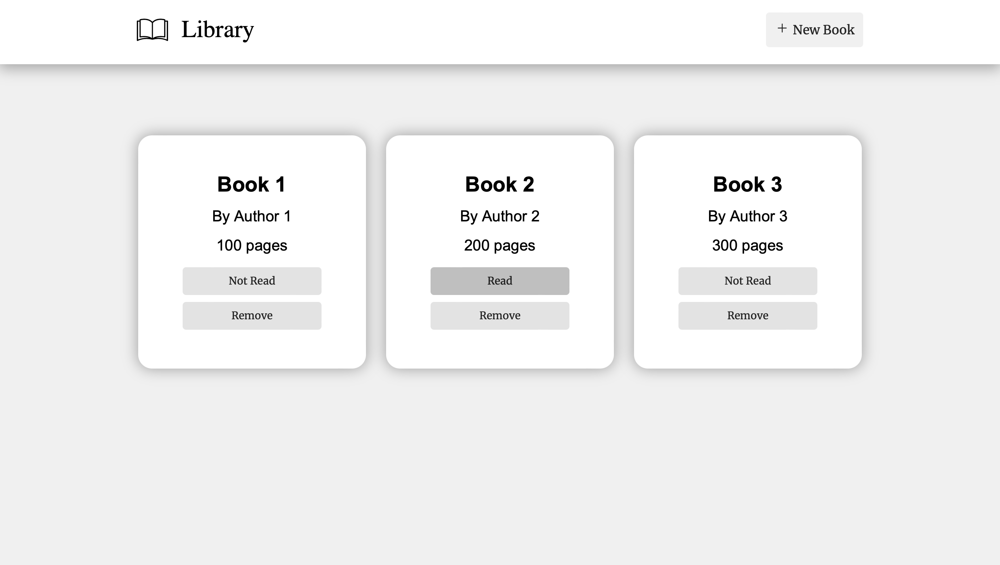

# Library 

This was `library`, the [*8th project*](https://www.theodinproject.com/lessons/node-path-javascript-library) within the Odin Project curriculum and the 1st one in the JavaScript course. This was a project that made students utilise object constructors to organize their code and create a fully fledged library to track read and unread books.

## Links

- [*Live Preview*](https://devvivan.github.io/odin-library/)
- [*My Progress*](https://github.com/DevVivan/odin-project)

## What did this project teach me?

### HTML

- HTML forms
- HTML popups/modals using the `<dialog>` tag
  
### CSS

- CSS Grid
  - Grid advanced properties: using `auto-fit` for basic responsiveness
- Pseudo-classes

### JavaScript

- Toggling modals using `modal.showModal();` and `modal.close();`
- Using object constructors to organise code
   - Use object constructors within arrays
- Load content on DOM using JavaScript

## Images

